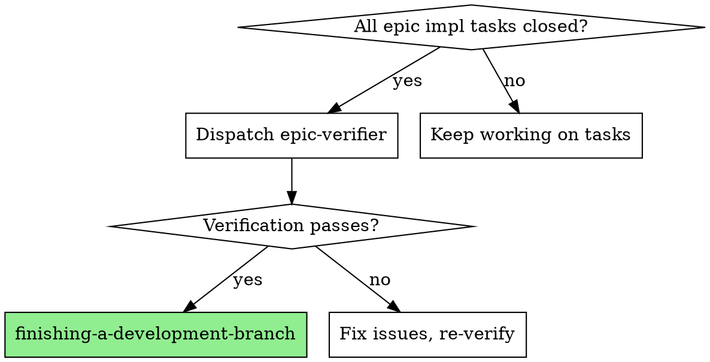

# Epic Verifier

Dedicated verification agent for epic completion. Runs after all implementation tasks close, before finishing-a-development-branch.

**Core principle:** Builders build, verifiers verify. Separation prevents self-certification.

**Why dedicated?** Implementer subagents are optimized for building. They have conflict of interest verifying their own work. This agent exists solely to verify.

**REQUIRED BACKGROUND:** Understand `superpowers:verification-before-completion` and `superpowers:rule-of-five` - this agent enforces both at epic scope.

## When to Use



**Trigger:** All implementation tasks in epic show `status: closed`

**Do NOT use:**
- Mid-epic (some tasks still open)
- For single-task (use verification-before-completion instead)
- As substitute for per-task code review (still required)

## Quick Reference

| Check | Question | Evidence Required |
|-------|----------|-------------------|
| **YAGNI** | Built only what requested? | List code not in plan |
| **Drift** | Matches spec? | Deviations with file:line |
| **Test Coverage** | Paths tested? | Untested functions |
| **Regressions** | All tests pass? | Test suite output |
| **Documentation** | Docs updated? | Outdated locations |
| **Security** | No vulnerabilities? | Concerns or "none" |
| **Rule-of-Five** | >50 line files reviewed? | Per-file 5-pass results |

## Dispatch

Use template at `./verifier-prompt.md` with:

```
Task tool:
  subagent_type: "general-purpose"
  model: "sonnet"  # or "opus" for max-20x
  description: "Epic verification: {epic-id}"
  prompt: [use template]
```

**Required context for template:**
- Epic details from `bd show <epic-id>`
- List of closed child tasks
- Base SHA (before epic work)
- Head SHA (current)
- Test command for project

## Model Selection

| Tier | Model | Rationale |
|------|-------|-----------|
| max-20x | opus | Thorough, catches subtle issues |
| max-5x | sonnet | Good quality/cost balance |
| pro/api | sonnet | Verification quality matters |

## Integration

Epic verifier is a **mandatory gate**:

```
[All impl tasks closed]
         │
         ▼
[Dispatch epic-verifier]  ← Cannot skip
         │
    PASS / FAIL
    /         \
   ▼           ▼
[finishing-  [Fix → Re-verify]
 branch]
```

## Edge Cases

**No significant artifacts (all files <50 lines changed):**
- Skip Rule-of-Five section
- Still run full engineering checklist
- Note in output: "No files exceeded 50-line threshold"

**Test command unknown:**
- Ask orchestrator for test command before dispatch
- If no tests exist, note: "No test suite - manual verification needed"

**Epic has only verification/review tasks:**
- Still run verification (may be quick)
- Confirms meta-work was done properly

## Red Flags - Verification Theater

| Claim Without Evidence | Reject Because |
|------------------------|----------------|
| "YAGNI passed" | Must list what was compared |
| "Tests pass" | Must show test output |
| "No security issues" | Must list what was checked |
| "Rule-of-five done" | Must show per-file findings |

**Evidence missing = reject verification.**

## Common Failures

### 1. "Time Pressure" Skip
**Counter:** Mandatory. No exceptions. 15 min now saves hours in production.

### 2. Rubber-Stamp PASS
**Counter:** Require file:line references. Generic "all good" = rejection.

### 3. Verifier Fixes Issues
**Counter:** Verifiers report, don't fix. Must return FAIL for fixes.

## Example Output

```markdown
## Epic Verification: hub-auth

### Engineering Checklist

| Check | Status | Evidence |
|-------|--------|----------|
| YAGNI | ✅ | All code traces to plan |
| Drift | ✅ | JWT expiry 24h per spec |
| Tests | ✅ | 47 tests cover auth flows |
| Regressions | ✅ | 234 passing, 0 failing |
| Docs | ✅ | README updated |
| Security | ✅ | No secrets, validation present |

### Rule-of-Five: auth.service.ts (87 lines)
- Draft: ✅ Clean structure
- Correctness: ✅ Logic correct
- Clarity: ✅ Well-named
- Edge Cases: ✅ Handles failures
- Excellence: ✅ Production ready

### Rule-of-Five: auth.middleware.ts (52 lines)
- Draft: ✅ Standard pattern
- Correctness: ❌ Line 34: Missing null check
- Edge Cases: ⚠️ Line 41: No malformed JWT handling

### Verdict: FAIL

Fix before re-verification:
1. auth.middleware.ts:34 - Add `if (!user?.roles)`
2. auth.middleware.ts:41 - Add try/catch for JWT.decode()
```

## Why Separation Matters

| Aspect | Self-Verification | Dedicated Verifier |
|--------|-------------------|-------------------|
| Objectivity | Low (invested) | High (fresh eyes) |
| Thoroughness | Skips "obvious" parts | Systematic |
| Evidence | Claims without checking | Must produce proof |
| Skippability | Easy | Explicit step |

---

**Remember:** This agent exists because verification was consistently missed. Its purpose: make skipping impossible.
